# 📘 Aprendendo a Aprender

Projeto adicional desenvolvido durante os **Sprints 3 e 4 do Bootcamp de Desenvolvimento**
**Web da TripleTen Brasil**.

O projeto consiste em um **site de página única (`One-Page Website`)** desenvolvido com
**HTML e CSS avançados**, seguindo roteiro e checklist rígidos, porém **sem guia passo a**
**passo**, tornando-o um desafio técnico e estrutural significativo.

---

## 🎯 Objetivo do Projeto

O objetivo principal foi **consolidar e aprofundar conceitos fundamentais e avançados de desenvolvimento front-end**, com foco em:

- Organização de código em grande escala
- Uso consistente de `HTML semântico`
- Construção de layouts complexos com `Flexbox`
- Aplicação da metodologia `BEM Flat`
- Implementação de `animações CSS`
- Integração de `iframes, fontes externas e formulários`

Este projeto simula um cenário mais próximo da realidade profissional, onde o
desenvolvedor recebe requisitos claros, mas precisa **tomar decisões técnicas de forma independente**.

---

## 🛠️ Tecnologias e Técnicas Utilizadas

- **HTML5 semântico**
- **CSS3** avançado
- **Flexbox** para layout e alinhamento
- **Metodologia BEM** (`BEM Flat`)
- **Google Fonts**
- **Pseudo-classes** (`:hover`, etc.)
- **Animações CSS** com `@keyframes`
- **Posicionamento** relativo e absoluto
- `iframes` (integração de vídeos)
- **Formulários HTML com validação nativa**
- `Normalize.css`
- **Estrutura modular de arquivos CSS**

---

## 🗂️ Estrutura do Projeto

```bash
/ projeto-adicional_aprendendo-a-aprender/
├── .vscode/ # Configurações do workspace
│   ├── extensions.json
│   └── settings.json
├── blocks/
│   └── # Blocos CSS organizados segundo a metodologia BEM Flat
├── images/
│   ├── logo/
│   ├── README/
│   └── # Imagens do projeto (conteúdo)
├── styles/ # CSS principal da página
│   └── style.css
├── vendor/ # Arquivos de terceiros
├── .editorconfig # Padronização de estilo entre editores
├── .gitignore # Arquivos e pastas ignorados pelo Git
├── .prettierignore # Arquivos ignorados pelo Prettier
├── index.html # Estrutura principal da página
└── README.md # Documentação do projeto
```

A arquitetura segue rigorosamente o **padrão BEM Flat**, com cada bloco isolado em seu
próprio arquivo CSS.

---

## ✨ Funcionalidades e Destaques

### 🔹 HTML semântico

Uso correto de `header`, `main`, `section`, `ul`, `li`, entre outros.

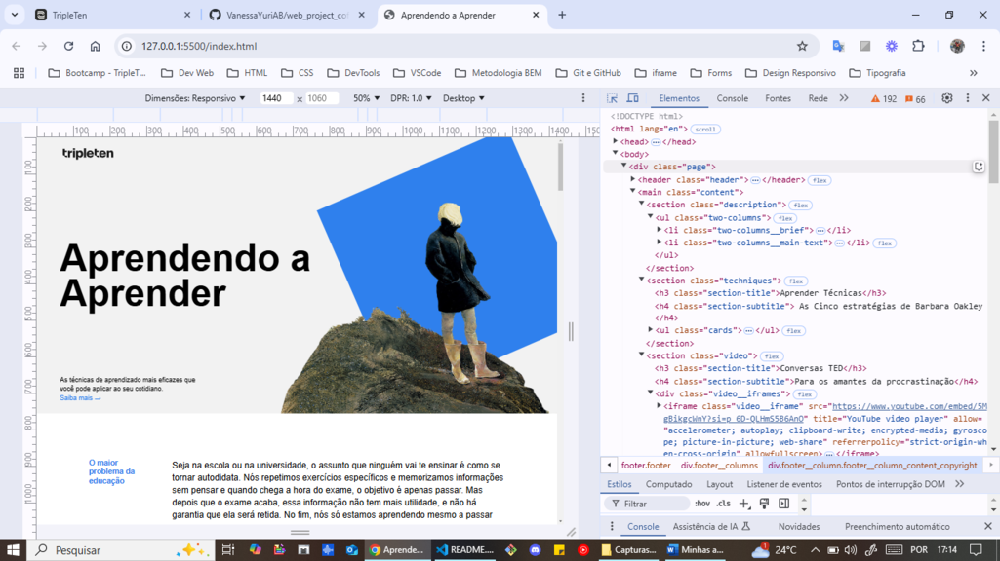

### 🔹 Layout com Flexbox

Distribuição, alinhamento e responsividade baseados exclusivamente em `Flexbox`.

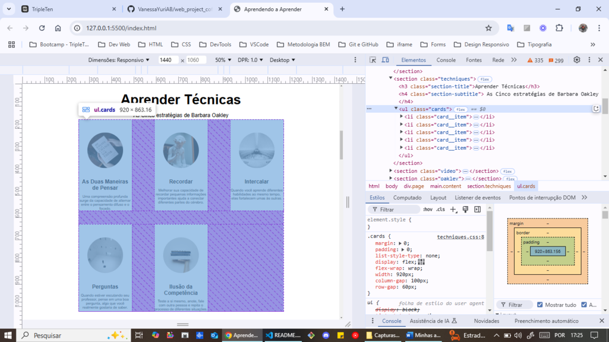
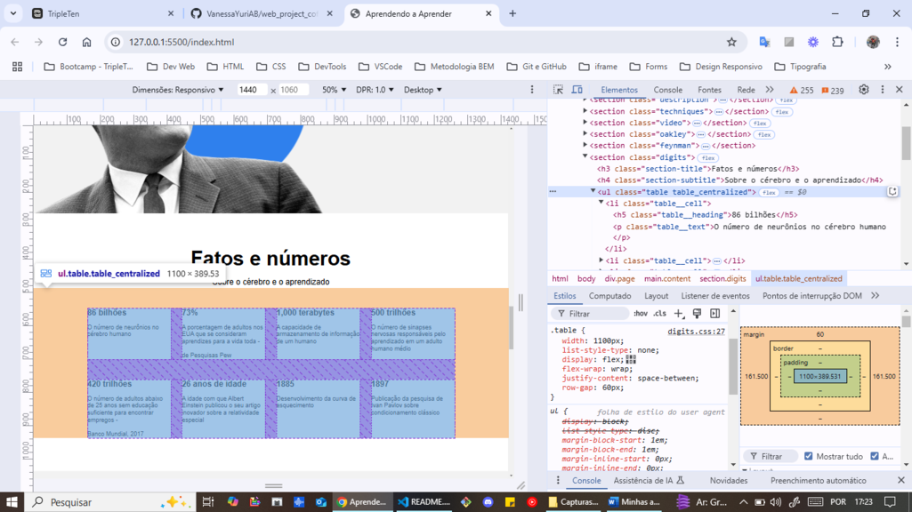

### 🔹 Posicionamento de elementos

Uso criterioso de `posicionamento relativo` e `absoluto` conforme exigido pelo roteiro.

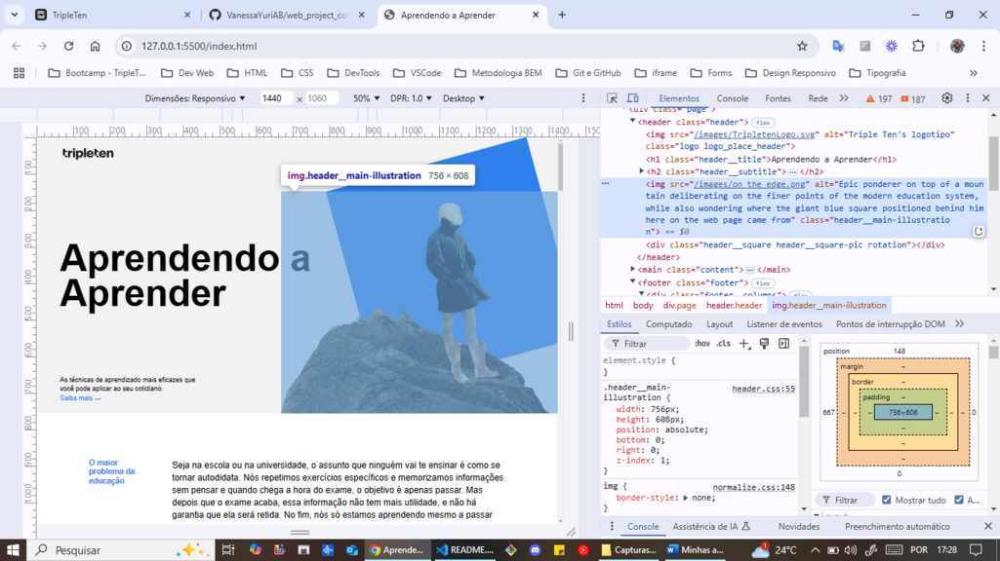
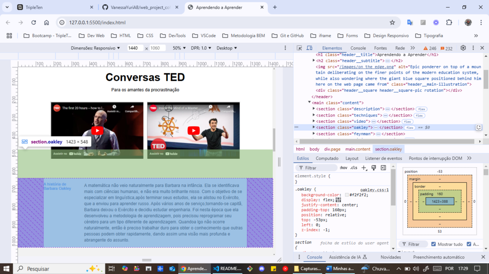

### 🔹 Google Fonts

Integração de fontes externas conforme o design original.

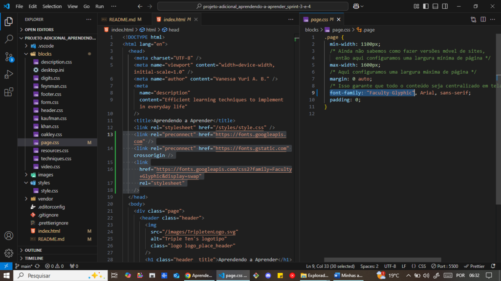

### 🔹 Pseudo-classes

Efeito de `hover` suave aplicado a todos os links do site.

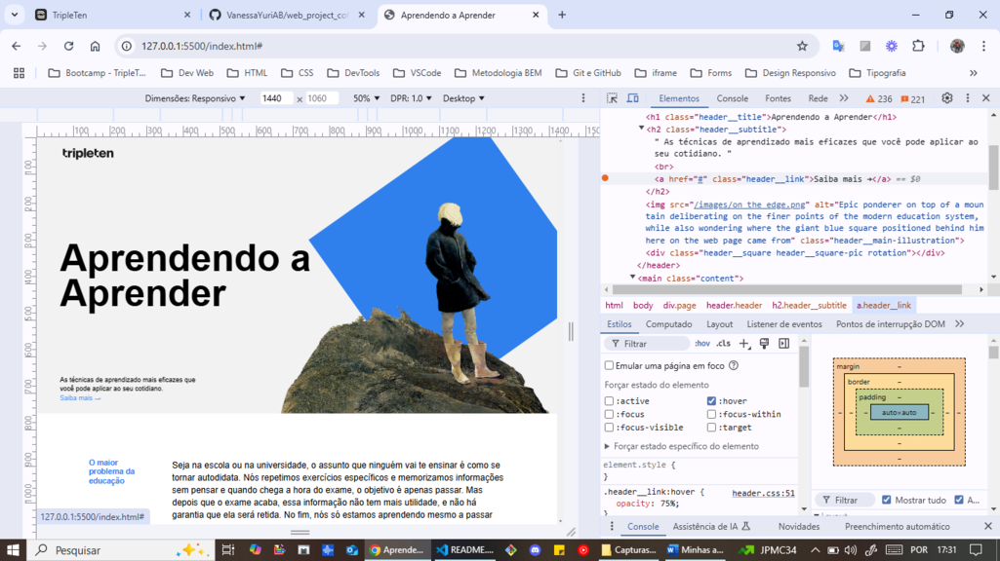

### 🔹 iframe

Incorporação de vídeos externos respeitando boas práticas de semântica e acessibilidade.

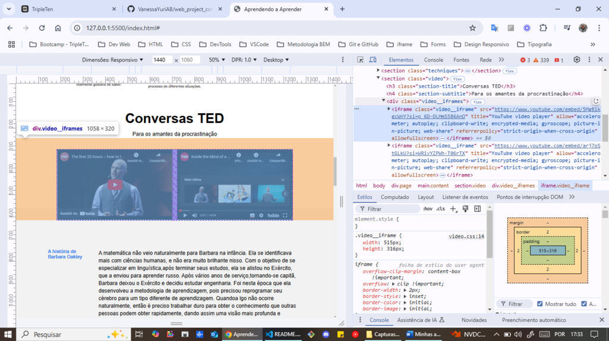

### 🔹 Animações CSS

Elementos animados utilizando **`@keyframes` e animações contínuas em loop**.

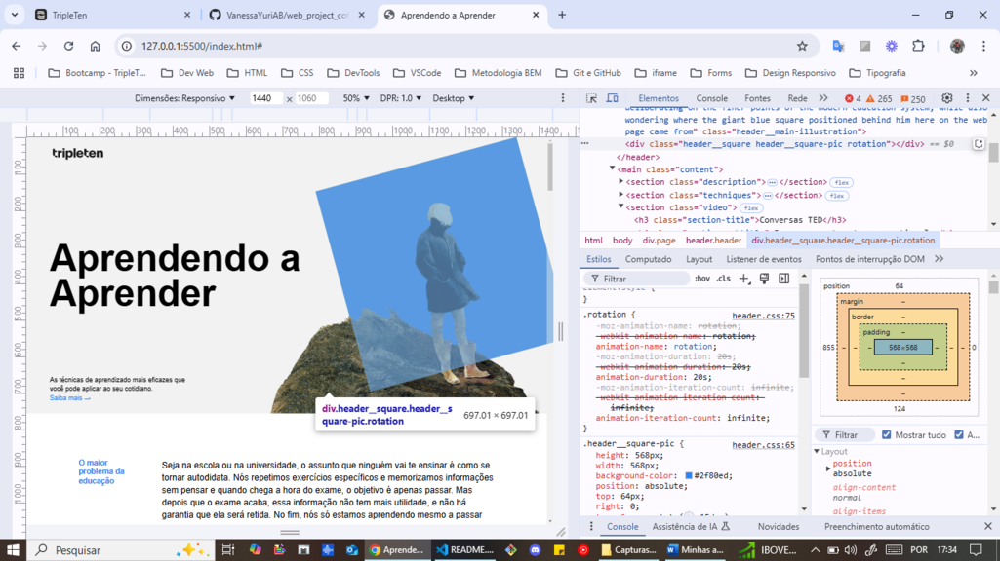

### 🔹 Formulário

Formulário funcional com **validação HTML5 nativa**, por meio dos atributos `required` e
`type`, conforme exigido pelo checklist do projeto.

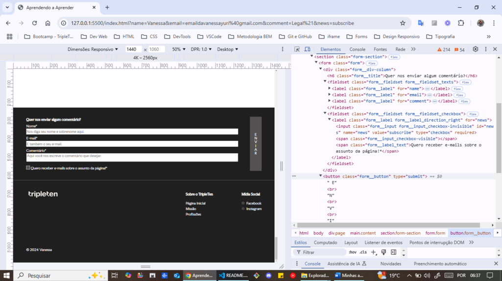

### 🔹 BEM Flat

Estrutura clara, escalável e reutilizável seguindo rigorosamente o padrão `BEM Flat`.

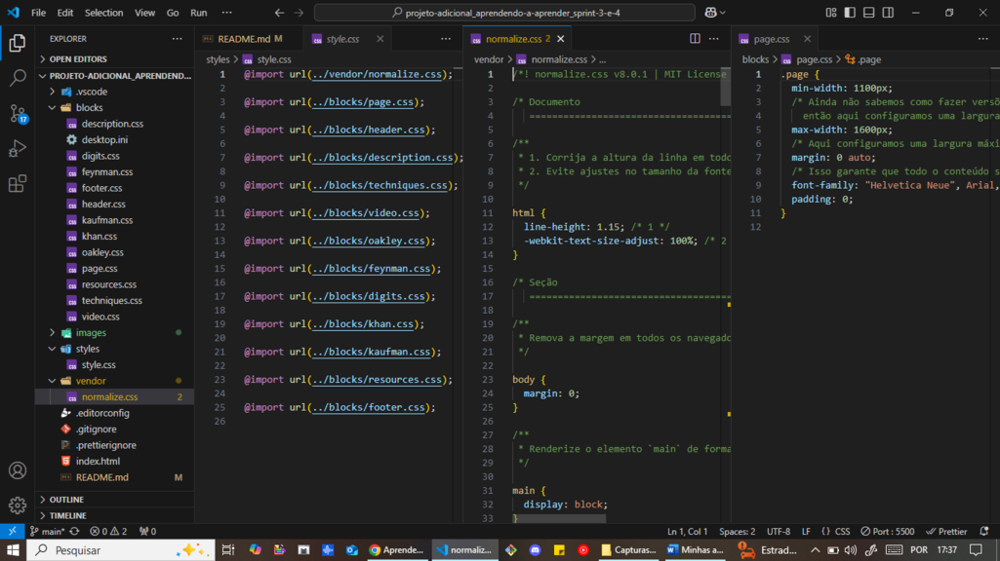

---

## 🚀 Como abrir o projeto

1. Você pode abrir o projeto localmente:

```Shell
git clone git@github.com:VanessaYuriAB/web_projetc_learning_to_learn.git
```

2. Depois, abra o arquivo `index.html` diretamente no navegador ou use a extensão
   `Live Server` do `VS Code`.

---

## 📌 Possíveis Melhorias

- Adicionar vídeos educativos autorais ou favoritos
- Garantir compatibilidade `cross-browser` com **prefixos de fornecedor**
- Aprimorar acessibilidade (`ARIA`, contraste e navegação por teclado)
- Evoluir o formulário para envio real de dados
- Pequenos refinamentos visuais e de performance

---

## ✅ Status do Projeto

Concluído conforme checklist.

---

## 👩‍💻 Autora

Vanessa Yuri A. Brito

🧪 Projeto adicional e desafio independente, com foco em aprendizado técnico e
organização de código.
